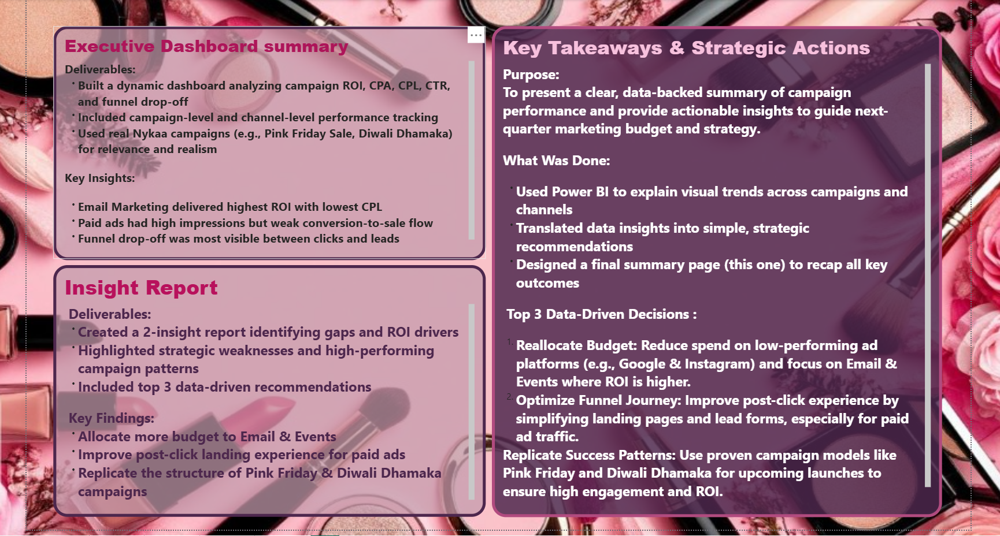

# Nykaa Marketing Campaign & Channel Performance Dashboard

Power BI | Marketing Analytics | ROI | CPL | CTR | Conversion Funnel

---

## Project Overview

This project showcases a comprehensive marketing analytics dashboard built in Power BI to evaluate the performance of Nykaa’s omnichannel campaigns.  
It focuses on analyzing critical marketing metrics such as ROI, CPL, CTR, and Conversion Rates across digital and offline channels to identify performance drivers and optimize marketing spend.

The dashboard simulates real campaign data to deliver insights on audience engagement, channel profitability, and conversion efficiency.  
It demonstrates how data visualization and storytelling can drive strategic marketing decisions in a fast-moving e-commerce environment.

---

## Dashboard Introduction

---

## Objectives

- Measure and compare Return on Investment (ROI) and Cost per Lead (CPL) across marketing channels.  
- Identify funnel inefficiencies and customer drop-offs across the journey from Impressions to Conversions.  
- Analyze engagement effectiveness using CTR vs Conversion Rate correlation.  
- Recommend budget reallocation strategies based on channel efficiency and ROI performance.  
- Present findings through a visually consistent and insight-driven Power BI dashboard.

---

## Dataset and Scope

**Dataset Type:** Simulated marketing dataset  
**Data Size:** ~50,000 records  
**Time Frame:** January – December 2024  

**Channels Analyzed:**  
- Instagram Ads  
- Google Ads  
- Email Marketing  
- Influencers  
- Events  

**Key Metrics:** ROI, CTR, CPL, CPA, Conversions, Spend, Revenue  

**Campaigns Covered:**  
- Pink Friday Sale  
- Diwali Dhamaka  
- Summer Super Saver  
- Monsoon Beauty Rush  
- Winter Glam Fest  

---

## Tools and Techniques

| Category | Tools / Skills |
|--------|---------------|
| Data Visualization | Power BI |
| Data Cleaning & Transformation | Power Query, Excel |
| KPI Development | DAX Formulas |
| Analytical Focus | ROI, CPL, CPA, CTR, Conversion Rate |
| Design Approach | Interactive Filters, Gradient Layout, Clean Typography |
| Insight Communication | Executive Summary and Recommendations |

---

## Key Insights

### Channel Performance

- Email Marketing achieved the highest ROI (3,472%) and the lowest CPL (₹13).  
- Instagram Ads recorded the highest CPL (₹85) with low conversion efficiency.  
- Google Ads generated strong visibility but underperformed in ROI due to higher acquisition costs.

---

### Funnel Performance

- Significant drop-off observed from Clicks to Leads (16.5K → 7.5K).  
- Average conversion rate across campaigns was 1.6%.

---

### Strategic Recommendations

- Increase budget allocation to Email and Event Marketing to improve ROI.  
- Optimize landing pages to reduce post-click conversion drop-offs.  
- Replicate successful campaign structures such as Pink Friday Sale.

---

## Dashboard Structure

### Page 1: Campaign & Channel Performance
- ROI, CPL, and CPA comparisons  
- Spend and revenue summaries  

### Page 2: Engagement & Funnel Efficiency
- CTR vs Conversion Rate visualization  
- Conversion funnel analysis  

### Executive Summary

## Executive Summary

---

## Outcomes

- Developed a full-scale marketing analytics dashboard using Power BI.  
- Converted raw campaign data into actionable insights for business decision-making.  
- Strengthened skills in data visualization, business analysis, and storytelling.  
- Demonstrated data-driven marketing strategy development.

---

## About the Author

**Shraddha Shukla**  
MBA in Business Analytics | Power BI Developer | Business Analyst  

**LinkedIn:**  
https://www.linkedin.com/posts/shraddha-shukla-s922_marketinganalytics-powerbi-digitalmarketingstrategy-activity-7350905690766331904-FSFQ  

**GitHub:**  
https://github.com/shra229  

**Email:**  
shraddhashukla09055@gmail.com
